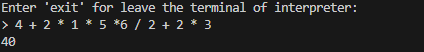

# Math-Interpreter

This is a interpreter of math expressions.
 

Hello, I can say this: "This is my first and successful project in Programming language theory".
I made an interpreter to interpret math expressions and share it with you.

**Note**: Please do not worry that they are all in one file.
They will all be categorized.

**How to work**:

**Lexer**: When we write anythings interpreters can not read that as directly and can't parse, we separate text (input) as tokens. If token is correct, it publish with its type and value.

**Parser**:  
 Here is may be confuse.

**(Parser) Method of eat**:
If taken token is expected token, eats that and next other token.
Thanks to method, we know our way.

**(Parser) Method of parseFactor**:
Convert potential tokens to integer from string text and thanks to which we can parse they.

**(Parser) Method of parseExpression**:
We processing multiply and divide in here.
When we processing these, we offer integer from parseFactor.
We take first integer with result variable like: (2) * 2, and we check if token multiply or divide: 2 (*) 2 if like that, remember we assign result first integer, opposed potential multiply op: (2) \* 2, now we assign to variable of result last integer result by multiplying result.

**(Parser) parseTerm method**:
The logic of the function is the same as parseExpression.
So why don't we use parseFactor?

Because we get the result of all multiplication and division operations, and with eat func we pass all the operations processed and store the result in the result variable. Thus, there are no plus and minus operations in parseExpression and the parameter related to parseTerm operations comes to the parseTerm method with the result variable.
